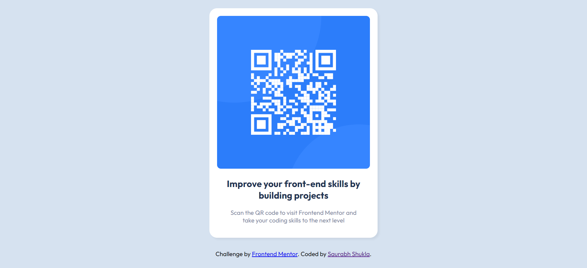

# Frontend Mentor - QR code component solution

This is a solution to the [QR code component challenge on Frontend Mentor](https://www.frontendmentor.io/challenges/qr-code-component-iux_sIO_H). 

## Table of contents

- [Overview](#overview)
  - [Screenshot](#screenshot)
  - [Links](#links)
- [My process](#my-process)
  - [Built with](#built-with)
  - [What I learned](#what-i-learned)
  - [Continued development](#continued-development)

- [Author](#author)
- [Acknowledgments](#acknowledgments)


## Overview

### Screenshot




### Links

- Solution URL: [Add solution URL here](https://your-solution-url.com)
- Live Site URL: [Click Here]https://saurabh13042004.github.io/QR-CODE-CHALLENGE-BY-FRONTEND-MENTOR.IO/)

## My process

### Built with

- Semantic HTML5 markup
- CSS custom properties
- Flexbox
- CSS Grid
- Mobile-first workflow


### What I learned

The major learnings while working through this project was to implement the learning of CSS i learned . Through this i also learned how to use the CSS flexbox and media queried to make the website responsive. I also learned how to use the CSS variables to make the website more dynamic and easy to change the color of the website.

Some code that I'm proud of (just a part of fun):

```html
<h1>Some HTML code I'm proud of</h1>
```
```css
.proud-of-this-css {
  color: papayawhip;
}
```
```js
const proudOfThisFunc = () => {
  console.log('🎉')
}
```


### Continued development

I will try to focus to make more dynamic and responsive website in the future. I will also try to make the website more interactive and user friendly. I will also try to make the website more accessible to the user.


## Author

- Linkdin - [Saurabh Shukla](https://www.linkedin.com/in/saurabh-shukla-0b45b3224/)
- GitHub Profile - [@Saurabh13042004](https://github.com/Saurabh13042004)
- Instagram- [@saurabh._shukla._](https://www.instagram.com/saurabh._shukla._)


## Acknowledgments

I would liked to thank Dr. Angela Yu for her guidance and support in web development bootcamp. Because of her i was able to learn the basics of web development and i was able to complete this project. 


**Thanks**
